# Create MacOS Install
(Hackintosh) utility to Download any Apple OS's and create a bootable install media.

It will also set the Downloadable OS with the right distribution suffix.
## 

## 
- Main panel will check your machine specs and the latest supported OS for it

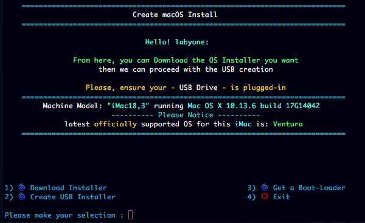
##
- Latest seeds are now set to current Release Catalog

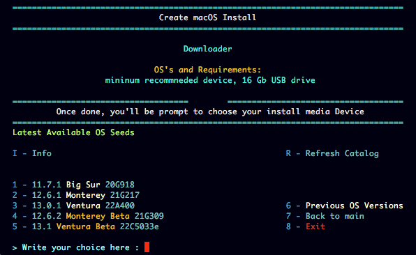

- And can Switch to betas by selecting the menu option

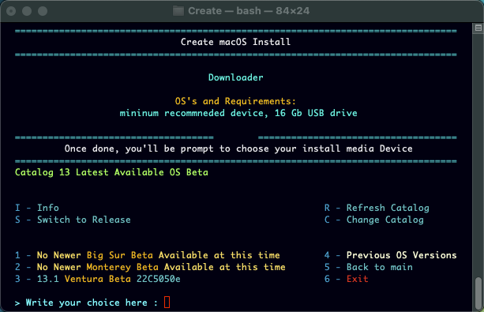

- Add possibility to change catalog and Switch to older

- 1

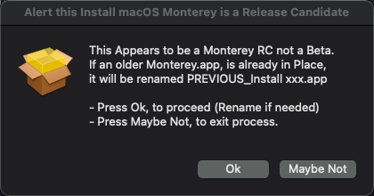

- 2

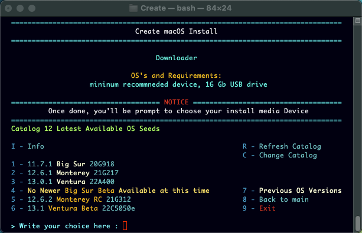

- Add warning for Release Candidate, seeds

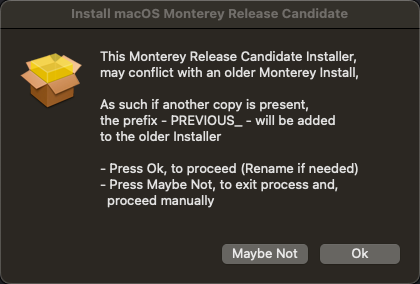
##
- Previous OS's

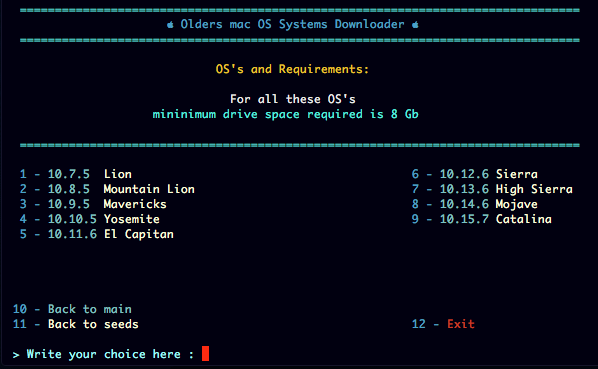
##
- Create install media

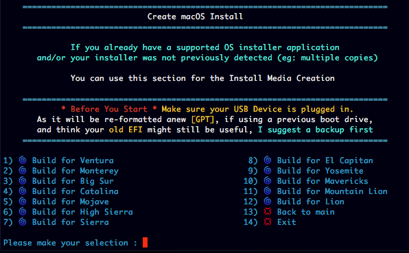
##
- Formatting your device

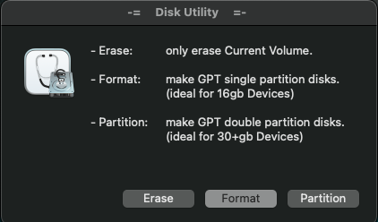

- for Older Systems (needed space requirements)

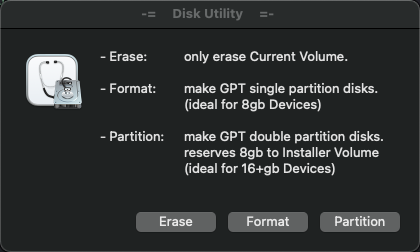
##
- Get and install a Boot Loader

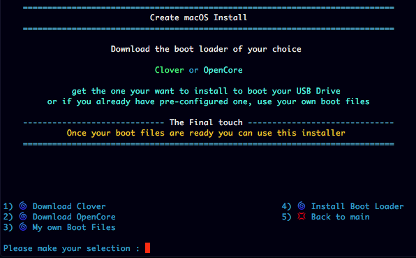
##
[Download](https://github.com/LAbyOne/Create-MacOS-Install/releases)
##

